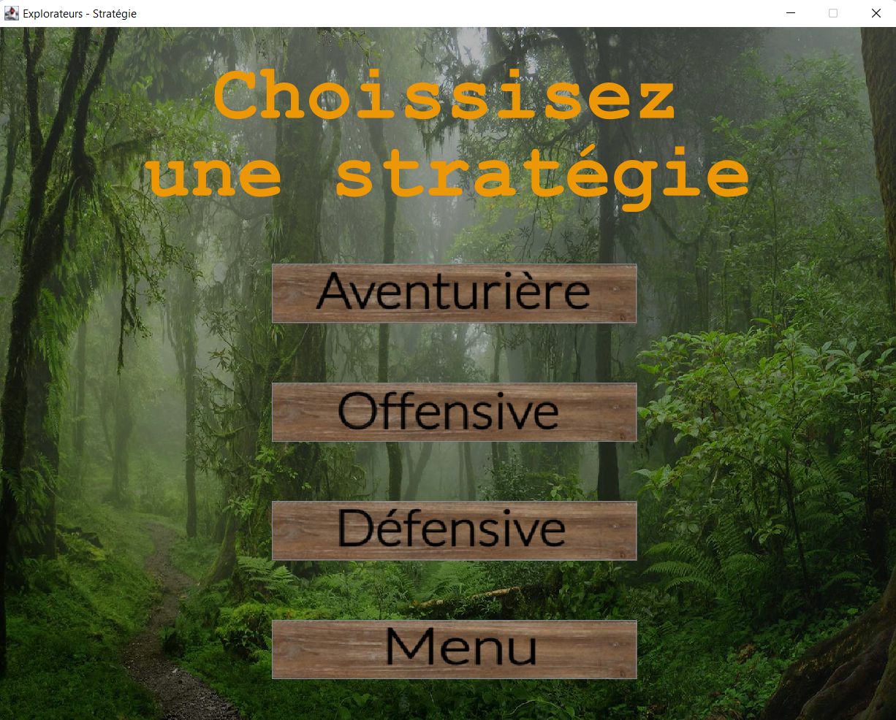
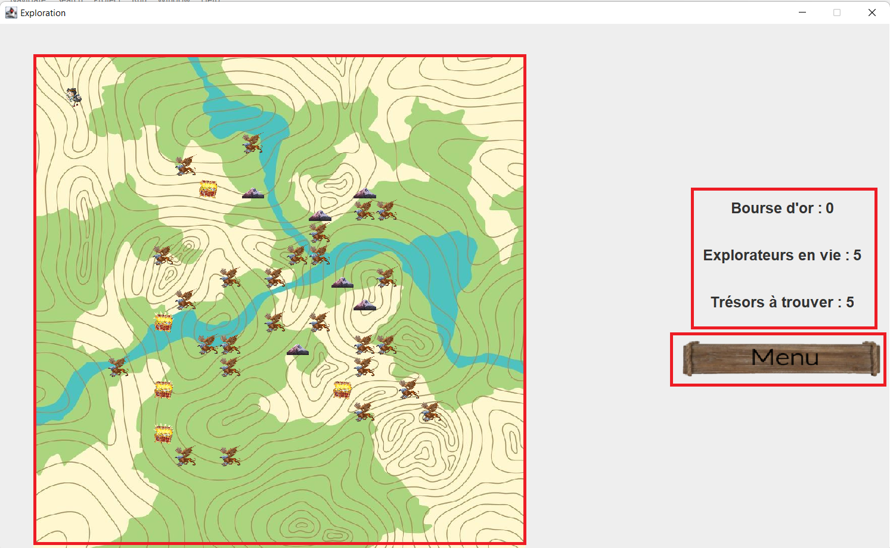

# Exploration-Simulator

The project consist to make an adventure game simulator for various players where the goal is to combine the best strategy and best equipments to recuperate all the treasures and in the same time surviving to the assaults of monsters.  
The project is developed in java and used the multithreading technology to manage the deplacement of each entities.   
Licence 3 project made for the Integration Project cursus at CY Paris Université.  
Made with Afatchawo Junior and Chriqui Nathan.  

Here some of the functionalities of our project :

The map of the simulation :

The selection mode :

The main window :

Display of end-game results :

